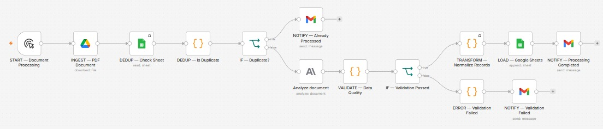

🇧🇷 **Português** | 🇺🇸 [English](README.md)

# n8n PDF AI Data Pipeline

Um **pipeline automatizado de extração de dados de PDF e ETL** construído com **n8n**, **Anthropic Claude**, **Google Drive** e **Google Sheets**. Ele lê um relatório em PDF, extrai com IA os registros de uma tabela-alvo, valida o resultado, verifica duplicidade e carrega dados limpos em uma planilha, com notificação por e-mail em cada desfecho.



> **Observação:** todos os documentos e valores deste repositório são **fictícios**, criados apenas para demonstrar o pipeline.

## O problema

Copiar manualmente os dados de relatórios em PDF para uma planilha é lento e sujeito a erros. Dois problemas pioram o cenário: o mesmo arquivo poder ser processado duas vezes e dados ruins chegarem à planilha sem ninguém perceber. Este pipeline automatiza a extração e adiciona travas para que o que chega na planilha seja confiável.

## Resultado

No caso real que originou o projeto, preencher a planilha manualmente a partir de um lote de 14 PDFs levava cerca de **3 horas**. Com o pipeline, o mesmo lote leva cerca de **15 minutos**.

| | Processo manual | Com o pipeline |
|---|---|---|
| Lote de 14 PDFs | ~3 horas | ~15 minutos |
| Por documento | ~13 minutos | ~1 minuto |
| Redução de tempo (processamento automatizado) | n/a | **~92%** |
| Redução de tempo (incluindo revisão humana) | n/a | **~70%** |

O pipeline foi pensado para funcionar com um humano no processo: o número de ~92% cobre o processamento automatizado, e o de ~70% é o ganho de ponta a ponta quando se conta a revisão humana dos resultados.

*Esses números vêm do caso de uso original. Este repositório usa apenas dados fictícios.*

## Como funciona

| Etapa | Nó | O que faz |
|---|---|---|
| **Ingestão** | `INGEST — PDF Document` | Baixa o PDF do Google Drive |
| **Deduplicação** | `DEDUP — Check Sheet` → `DEDUP — Is Duplicate` → `IF — Duplicate?` | Procura o ID do arquivo no Drive na planilha de destino. Se já estiver lá, avisa por e-mail e encerra |
| **Extração** | `AI — Document Extraction` | Envia o PDF ao Claude, que devolve as linhas da tabela em JSON estruturado |
| **Validação** | `VALIDATE — Data Quality` → `IF — Validation Passed` | Uma etapa em JavaScript checa a saída da IA antes de gravar qualquer coisa |
| **Transformação** | `TRANSFORM — Normalize Records` | Cria um registro normalizado por linha da tabela e anexa metadados técnicos |
| **Carga** | `LOAD — Google Sheets` | Adiciona os registros na planilha de destino |
| **Notificação** | `NOTIFY — ...` | Envia e-mail para cada desfecho: já processado, concluído ou falha na validação |

### Três desfechos possíveis

1. **Duplicado:** o documento já foi processado → e-mail "Already Processed", sem nenhuma chamada à IA.
2. **Validação falhou:** a extração não passou nas checagens de qualidade → relatório de erro + e-mail "Validation Failed" listando os problemas. Nada é gravado na planilha.
3. **Sucesso:** os registros são normalizados, adicionados ao Google Sheets e um único e-mail "Processing Completed" é enviado.

## Contrato de dados

A etapa de IA busca a tabela da seção **"2. Registros de Atendimento"** e deve devolver exatamente este JSON (os nomes dos campos estão em português porque os documentos de origem são em português):

```json
{
  "atendimentos": [
    {
      "cnes": "...",
      "placa": "...",
      "tipologia": "...",
      "compet": "...",
      "uf": "...",
      "municipio": "...",
      "oci": "...",
      "quantidade": 0
    }
  ]
}
```

Cada linha da tabela vira exatamente um objeto. O prompt orienta o modelo a extrair todas as linhas, nunca agrupar, somar ou inferir valores, usar `null` quando um campo não puder ser identificado com segurança e retornar somente JSON.

## Validação

O nó `VALIDATE — Data Quality` checa a resposta da IA antes de ela seguir no pipeline:

- a resposta é um JSON válido (cercas de Markdown são removidas se o modelo as adicionar)
- a raiz é um objeto com um array `atendimentos` contendo ao menos um registro
- todos os campos obrigatórios existem e nenhum é string vazia
- `quantidade` é um inteiro não negativo
- não há campos inesperados
- nenhum registro está totalmente vazio

Se qualquer checagem falhar, a execução vai para o caminho de erro em vez da carga.

## Deduplicação

O ID do arquivo no Drive é gravado na coluna `id_relatorio` de cada linha carregada. Antes de chamar a IA, o fluxo lê a planilha e verifica se esse ID já está lá. Assim os duplicados são cortados cedo, e nenhuma chamada de IA é gasta com um documento já tratado.

## Decisões de projeto

- **A deduplicação vem antes da IA.** Evita reprocessamento e custo desnecessário de IA.
- **A saída da IA nunca é aceita às cegas.** Uma extração que parece plausível mas está errada é pior do que uma que falhou, então a validação fica entre a extração e a carga.
- **Falhas são explícitas.** Todo ramo termina em uma notificação, então nada falha em silêncio.
- **Etapas separadas** (extrair → validar → transformar → carregar), o que torna cada uma testável e fácil de substituir.
- **Nomes de nós descritivos** (`ETAPA — ação`) deixam o fluxo legível de relance.

## Stack

- [n8n](https://n8n.io/): orquestração
- Anthropic Claude: extração de PDF assistida por IA (o fluxo está configurado com `claude-sonnet-5-5`; outros modelos Claude que aceitam PDF devem funcionar também)
- Google Drive, Google Sheets, Gmail
- JavaScript: nós Code para dedup, validação e transformação

## Estrutura do repositório

```
n8n-pdf-ai-data-pipeline/
├── README.md
├── README.pt-br.md
├── docs/
│   └── workflow.jpeg
├── workflow/
│   └── pdf-ai-extraction.json
├── samples/
│   └── (PDF de exemplo fictício)
└── .gitignore
```

## Configuração

1. Importe [`workflow/pdf-ai-extraction.json`](workflow/pdf-ai-extraction.json) no n8n.
2. Crie e selecione suas próprias credenciais do Google Drive, Google Sheets, Gmail e Anthropic.
3. Crie uma planilha no Google Sheets com uma aba chamada `Data` e esta linha de cabeçalho:
   `cnes | placa | tipologia | compet | uf | municipio | oci | qtd | atendimento | id_relatorio | file_name | data_processamento | valid`
4. Substitua os placeholders `YOUR_GOOGLE_DRIVE_FILE_ID` e `YOUR_GOOGLE_SHEETS_ID` (no nó do Drive e nos dois nós do Sheets) e `your-email@example.com` (nos três nós do Gmail).
5. Envie o PDF de exemplo de [`samples/`](samples/) para o seu Drive.
6. Teste os três cenários:
   - **Documento novo:** rode uma vez e confira as linhas e o e-mail de sucesso.
   - **Duplicado:** rode o mesmo arquivo de novo; deve parar com o e-mail "Already Processed".
   - **Falha de validação:** rode com um PDF que não tenha a tabela esperada e confira o e-mail de falha.

> Esta é uma versão sanitizada para portfólio. Credenciais, documentos reais e identificadores pessoais foram intencionalmente excluídos.

## Limitações e roadmap

- O gatilho é manual e processa um arquivo do Drive por vez. Um gatilho do Drive ou um loop de pasta automatizaria o lote inteiro.
- [ ] Implementação equivalente no Activepieces
- [ ] Versão do pipeline em Python
- [ ] Comparativo entre as três abordagens

## Competências demonstradas

ETL · processamento de documentos com IA · validação de qualidade de dados · deduplicação · automação de fluxos · contratos de dados em JSON

## Licença

Disponível para fins educacionais e de portfólio.

## Autor

**Ricardo**: BI e Automação · [GitHub](https://github.com/RicardoCraveiro05)
